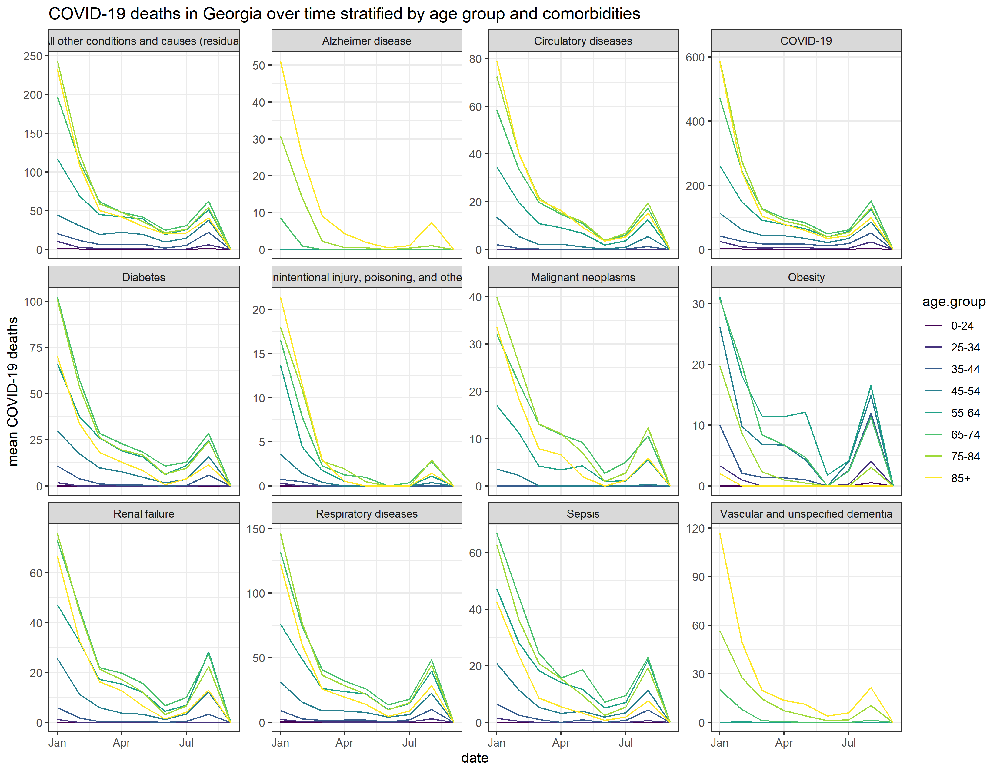
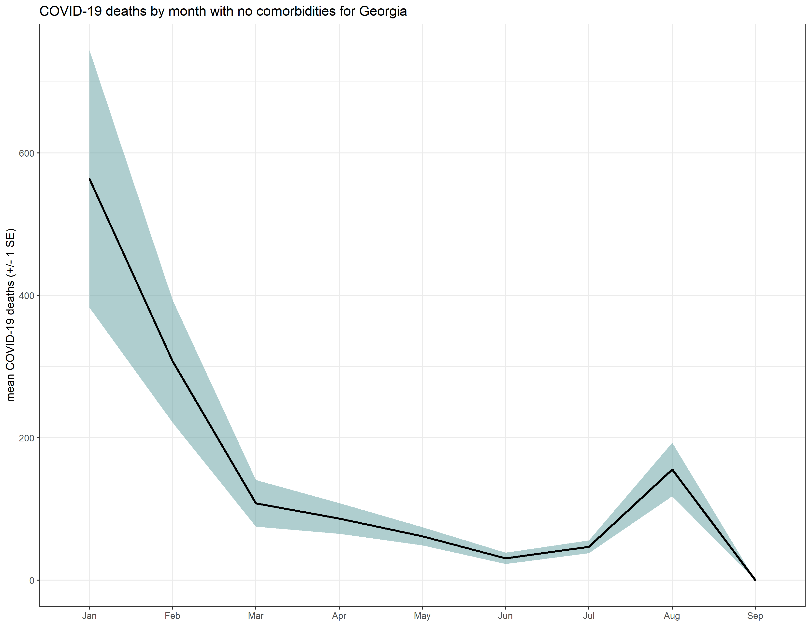
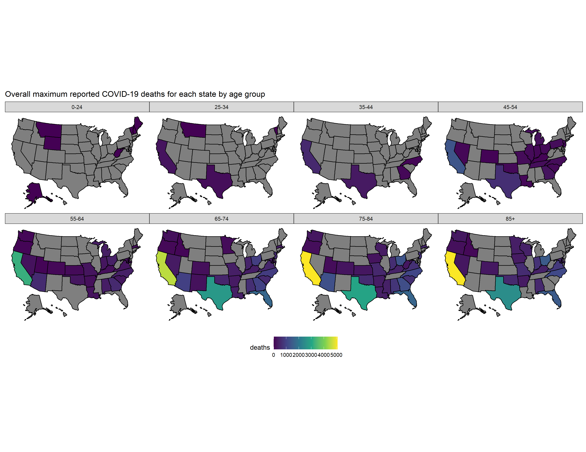

The structure below is a possible setup for a data analysis project (including the course project). For a manuscript, adjust as needed.


# Summary/Abstract


# Introduction 

## General Background Information


## Description of data and data source


## Questions/Hypotheses to be addressed


# Methods and Results

```{r resultfigure,  fig.cap='COVID-19 deaths in Georgia (USA) appear to show similar, though not identical, trends by age group when multiple comorbidities are examined.', echo=FALSE}

```

```{r resultfigure2, echo=FALSE}

```

```{r resultfigure3, echo=FALSE}

```


# Discussion

## Summary and Interpretation

## Strengths and Limitations

## Conclusions


This paper [@Leek2015a] discusses types of analyses. 

Note that this cited reference will show up at the end of the document, the reference formatting is determined by the CSL file specified in the YAML header. Many more style files for almost any journal [are available](https://www.zotero.org/styles). You also specify the location of your bibtex reference file in the YAML. You can call your reference file anything you like, I just used the generic word `references.bib` but giving it a more descriptive name is probably better.


# References


